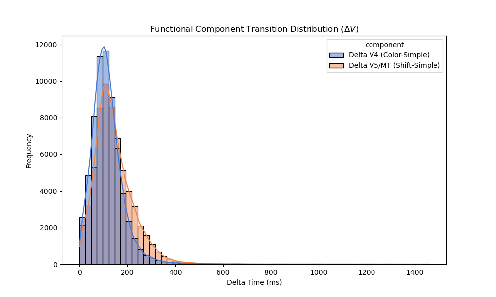
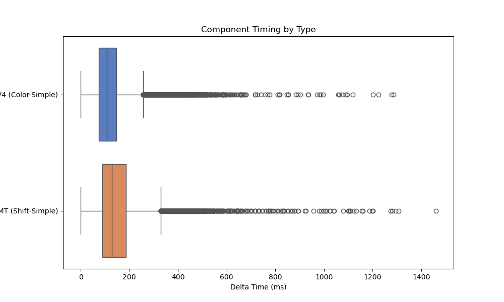
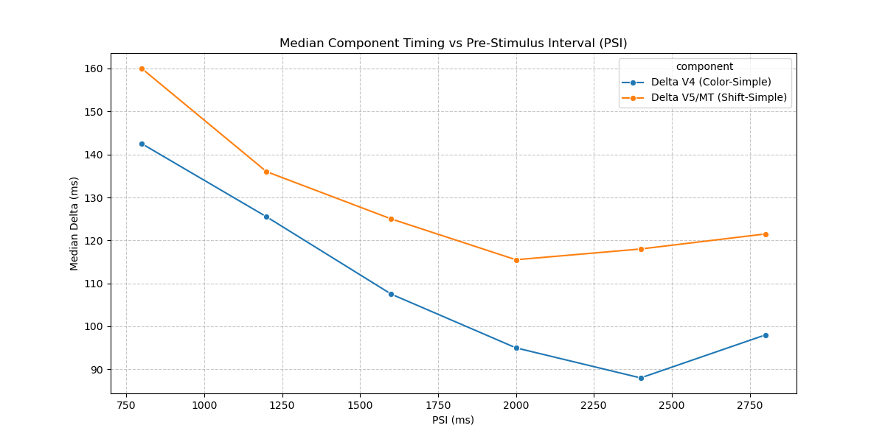
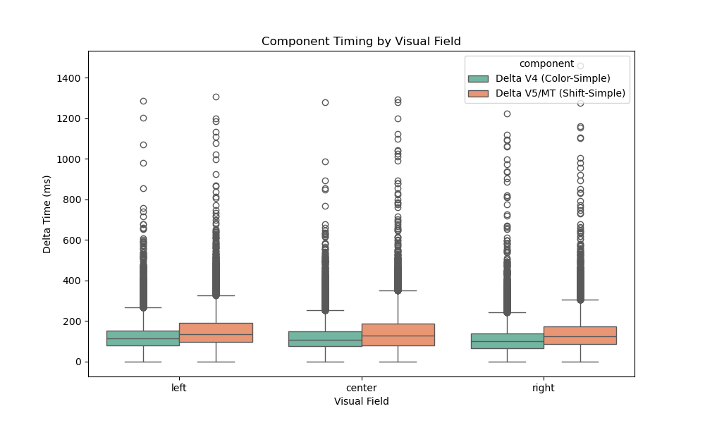
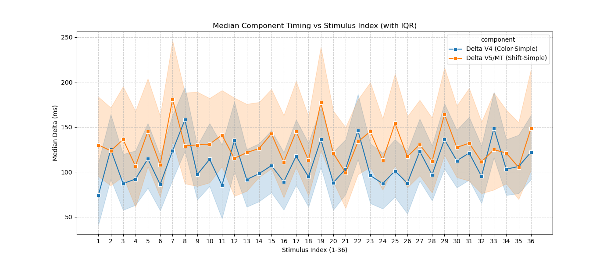
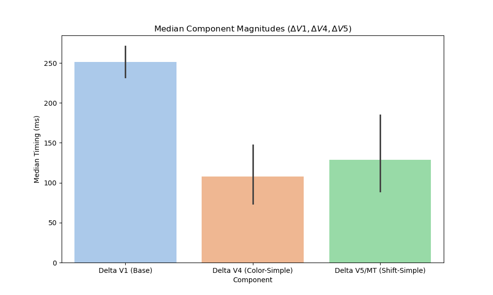
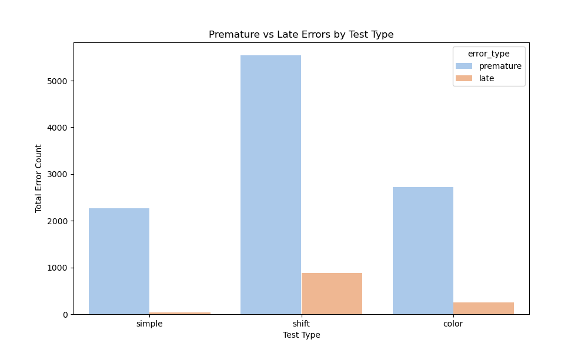

# Task 7 Stage L3 Report — Visual Pattern Exploration
    
Dataset: `neuro_data.db`
Generated automatically by `run_stage_L3.py`.

## Executed Queries
The visualizations below are derived from `reactions_view`, converting the wide-format Boxbase `trials` output into a long-format event table to enable pattern exploration. Error plots utilize trial-level error counters directly from the database schema.

## 1. RT Distribution
  
  
*Observational Note: Mean RT differs visibly between test types.*

## 2. RT vs PSI
  
*Observational Note: RT values show visible spread and variation across the different PSI levels.*

## 3. RT vs Visual Field
  
*Observational Note: The descriptive statistics indicate variations in median reaction time based on visual field presentation.*

## 4. RT vs Stimulus Index
  
*Observational Note: Mean reaction time fluctuates dynamically in an oscillatory pattern throughout the ordered sequence of 36 stimuli.*

## 5. RT vs Test Type
  
*Observational Note: Distinct bands of average RT are observable corresponding to each test type (simple, shift, color).*

## 6. Error Structure
  
*Observational Note: Premature error counts exhibit structural differences across the three test types.*
